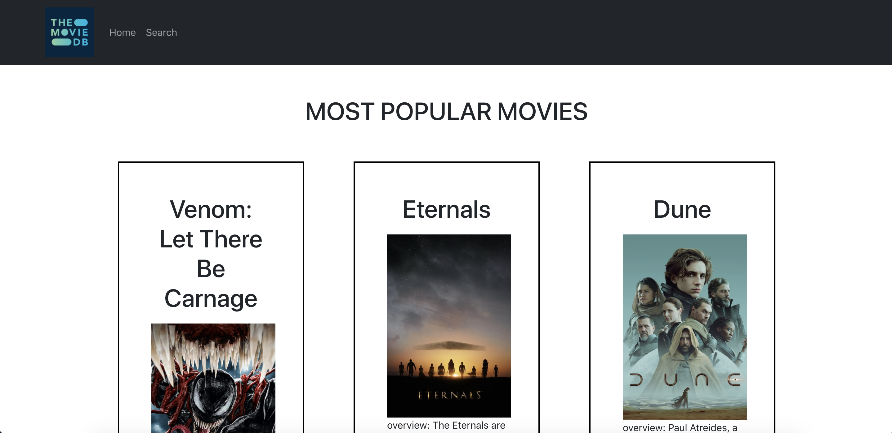

# NorthwesternMutal-

coding challenge

This application uses API from TMDB.
Features: - Displays the top popular movies to current date - Search movies based on title
-Sort button can display search results by popularity or release date
-Navigation bar
-Pop up Modal that displays additional information when each movie is clicked

